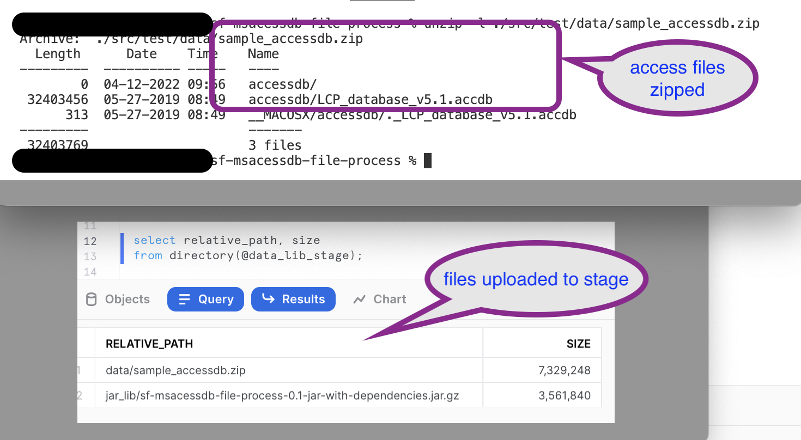

# sf-msacessdb-file-process
A demonstration of parsing MS Access (MDB/ACCDB) file, natively in Snowflake.

Dated : Apr-2022

## Overview

[Medium: Processing MS-Access database files natively in Snowflake](https://medium.com/@venkatesh-sekar-56341/processing-ms-access-database-files-natively-in-snowflake-f5a21df12597)

In my various engagements, Microsoft-Access databases (MDB/ACCDB) files are a common occurrence, apart from CSV, EXCEL, and PDFs. MS-Access is one of that well-loved software, which has been long used in the industry across various teams. It starts as a goto application for a quick application with forms, reports, and a database to satisfy a small team, and pretty soon it gets widely used. Copied, circulated around and multiple versions of the same application exist in the enterprise. 

There are even open datasets shared using MS-Access, as an example:

- [Estimated Oil and Gas Reserves](https://www.data.bsee.gov/Main/HtmlPage.aspx?page=estimated2018).

- [European Environment Agency](https://www.eea.europa.eu/data-and-maps/data/industrial-reporting-under-the-industrial-4)

- [Open Canada: National Pollutant Release Inventory](https://open.canada.ca/data/en/dataset/ea0dc8ae-d93c-4e24-9f61-946f1736a26f)

In one engagement in a large enterprise, there were counts of 500 or so such MS-Access applications. It was a challenge to consolidate all these applications and export data into a Data Lake environment. I have seen usage and adoption also across various verticals like Oil & Gas / Financial / Telecom to name a few.

In the past, we would have to write an export application, for example, using Java that would connect to MS-Access files using ODBC/JDBC and extract the data in a format that could then be ingested for Data Analysis.

With [Snowflake's ability to process unstructured data](https://resources.snowflake.com/webinars-thought-leadership/7-ways-to-start-using-unstructured-data-in-snowflake-3?utm_cta=website-blog-unstructured-data-support-launch&_ga=2.213311511.2046506607.1649778589-1203710688.1643249610), we now can parse and process MS-Access files natively too.

In this article, I walk-thru an example of processing MS-Access files using Java.

## Solution
**NOTE:** Much of the solution/example demonstrated here is meant to be used as a guide and not for production. You might need to change/re-implement as per your environment accordingly.
The source code is present here : [Github: sf-msacessdb-file-process](https://github.com/venkat-at-wloo/sf-msacessdb-file-process). 

### Java UDTF

Snowflake introduced the ability to read files from the stage (internal & external) and return records using [Java UDTF](https://docs.snowflake.com/en/developer-guide/udf/java/udf-java-tabular-functions.html). By adopting this approach, we could write a function that parses the MSAccess files from a stage all running inside Snowflake.

I have demonstrated this functionality as part of my earlier blog too [Processing WebArchive(WARC) files natively in Snowflake](https://medium.com/me/stats/post/fd973217dd96). 

### Parsing MS-Access files

[UCANACESS](http://ucanaccess.sourceforge.net/site.html) is a popular library used to parse MS-Access files. It can also be used to parse the latest MS-Access file format (accdb).

With these in play, we now could achieve the ability to process MSAccess files natively in Snowflake. I will not be explaining the steps and activities involved in setting up here; this is documented in the documentation pages as part of the [source code] code(https://github.com/venkat-at-wloo/sf-msacessdb-file-process)

## Execution

### Staging the files.
Refer [doc: setup](./doc/setup.md)



### Processing 

#### List Tables

[Java Source: ListTables](src/main/java/com/venkat/blog/msaccess/ListTables.java)

```sql
select * from 
    table(msaccess_parser(
        '@data_lib_stage/data/sample_accessdb.zip'
        ,'accessdb/LCP_database_v5.1.accdb'
    ));
```


#### Fetch Table
[Java Source: FetchTableRecords](src/main/java/com/venkat/blog/msaccess/FetchTableRecords.java)

```sql
select *
from 
    table(msaccess_fetch_table(
         '@data_lib_stage/data/sample_accessdb.zip'
        ,'accessdb/LCP_database_v5.1.accdb'
        ,'1_BasicData'
    ));
```


### Execution history

For this, I was using an XS warehouse size and as you could see below; it did not also take much time: 


## Observations & Limitations
As mentioned above, the sample code is just a demonstration of the capabilities. Here are some scenarios you might need to handle:

Access file password protection: The current code is using an unprotected access file, you would have to handle this using the java library.

Fetch table pagination: Though I had experimented in other scenarios whereby Java UDTF had returned rows in upwards of 20,000. It might not be the same when reading the access file. You would need to implement it.

Views & VBA Functions:  Though you could read the data from the table, I am not sure when it comes to reading views and invoking VBA functions embedded within the Access file. You need to explore this, based on your sample dataset.
